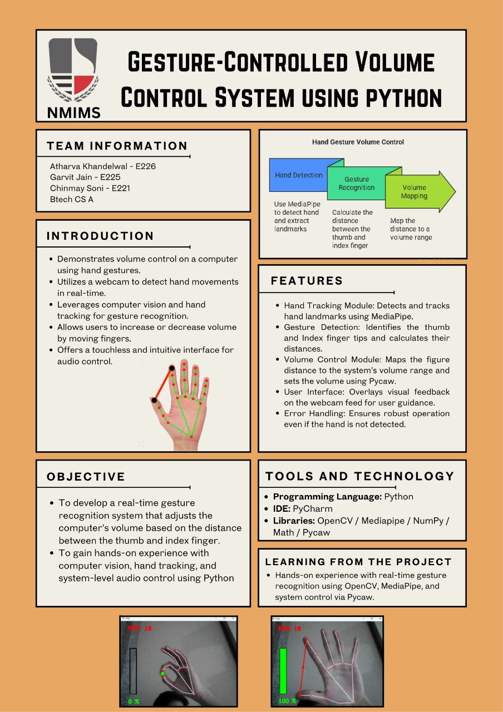

# Python_first_project

A Python project using OpenCV and MediaPipe for real-time hand tracking and gesture-based system volume control.



## Overview

This project leverages computer vision to recognize hand gestures from webcam input and control the system volume based on finger positions. It uses the following technologies:
- **OpenCV**: For capturing webcam video and processing images.
- **MediaPipe**: For hand landmark detection.
- **pycaw**: For controlling system volume on Windows.

## Key Features

- Real-time hand tracking with webcam.
- Detects fingertip positions and distance between fingers.
- Adjusts system volume using pinch gestures (thumb and index finger distance).
- Visual feedback on the video stream (landmarks, connecting lines, FPS, and a volume bar).

## File Structure

| File Name                                   | Description                                           |
|----------------------------------------------|-------------------------------------------------------|
| 1_basicvideocapturing.py                    | Basic webcam video capturing                          |
| 2_basichandrecoginition.py                   | Basic hand detection using MediaPipe                  |
| 3_Connecttipsoffingure.py                   | Connects tips of fingers                             |
| 4_addcircletofingretips.py                  | Draws circles on fingertip positions                 |
| 5_showfps.py                                | Displays frames per second on video                  |
| 6_Calculatingthedistancebetweenfingures.py  | Calculates distance between fingertips               |
| 7_makingbarwithdistance.py                  | Creates a bar to visualize distance/volume           |
| 8_connectingwithsystemvolume.py             | Controls system volume via finger distance           |
| Finalproject.py                             | **Main project file combining all features**          |
| Poster.jpg                                  | Project poster image                                 |

## Getting Started

### Prerequisites

- Python 3.7+
- Windows OS (pycaw is Windows-specific)
- Webcam

### Install Required Libraries

```bash
pip install opencv-python mediapipe pycaw comtypes
```

### Usage

Run the main file:

```bash
python Finalproject.py
```

- Show your hand to the webcam.
- Pinch gesture (thumb and index finger) controls the volume.
- Press `Q` or `Esc` to quit.

## How It Works

- The webcam stream is processed in real-time.
- Hand landmarks are detected using MediaPipe.
- The distance between thumb and index fingertip is calculated.
- This distance is mapped to the system volume range using pycaw.
- Visual feedback (landmarks, lines, circles, volume percentage, FPS, and a volume bar) is displayed on the window.

## Acknowledgements

- [MediaPipe](https://google.github.io/mediapipe/)
- [OpenCV](https://opencv.org/)
- [pycaw](https://github.com/AndreMiras/pycaw)

---

> Made by [Chinmay048](https://github.com/Chinmay048)